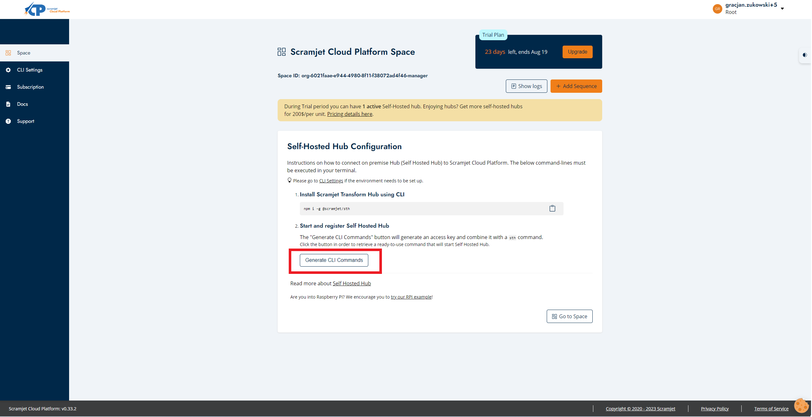
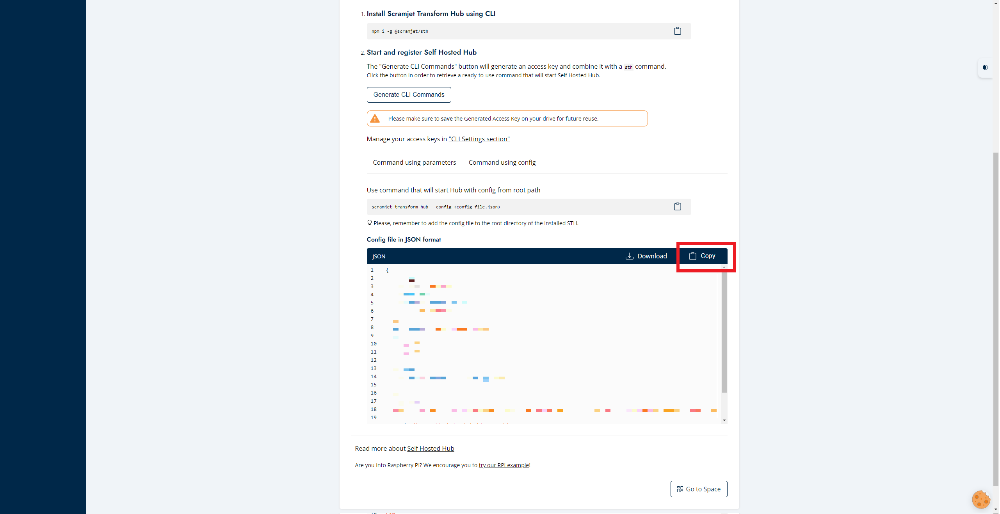

## Preparing the environment for image building

Linux will be required to build the image, so WSL is recommended for windows users.


## Dependencies
The whole process need to be started with the installation of all required dependecies:


```bash
apt-get install coreutils quilt parted qemu-user-static debootstrap zerofree zip \
dosfstools libarchive-tools libcap2-bin grep rsync xz-utils file git curl bc \
qemu-utils kpartx gpg pigz
```

The file depends contains a list of tools needed. The format of this package is <tool>[:<debian-package>].


## Getting started with building your images

Getting started is as simple as cloning this scramjet's fork on your build machine. You can do so with:

```bash
git clone git@github.com:scramjetorg/pi-gen.git
```

We then proceed to build the image. The whole process is done with the command, this may take a while:


```bash
./build.sh -c config 
```

## Burning disc image 
After the successful build, "deploy" folder will appear with the images.

Now use the [Imager](https://www.raspberrypi.com/software/) and under "Select OS" select "Custom OS" and then select the "<date>-rasppi-os-sth.img" file from the deploy folder you created.
Also, remember to set your network access for the device in the imager options.

Once the process is complete, two partitions should appear on your drive - boot and deploy.

## Config self-hosted-hub

Go to the scramjet cloud platform panel page and generate a configuration file for self-hosted-hub. Copy its contents and paste it into the file contained in the directory deploy/config/sth-config.json







Load the card with the configured image into your device and connect it to the power supply. After a while, a new self-hosted-hub should appear in your panel.


Now to control the hub using the command line, you need to install "cli" and generate the appropriate config, which will allow access to the hub.


## :boom: Troubleshooting :boom:: 
1. WSL, there may be a problem with WSL, because of the lack of the certain function. This problem is often associated with the "HyperV".
So to fix it, there is a need to enable HyperV in "Turn Windows features on or off" section.

2. After burning the image on SD card there may be a problem with accessing the partition with the "conf" folder. To solve this problem, there is a need
to add a new letter for the partition of the disk in "Disk management"
